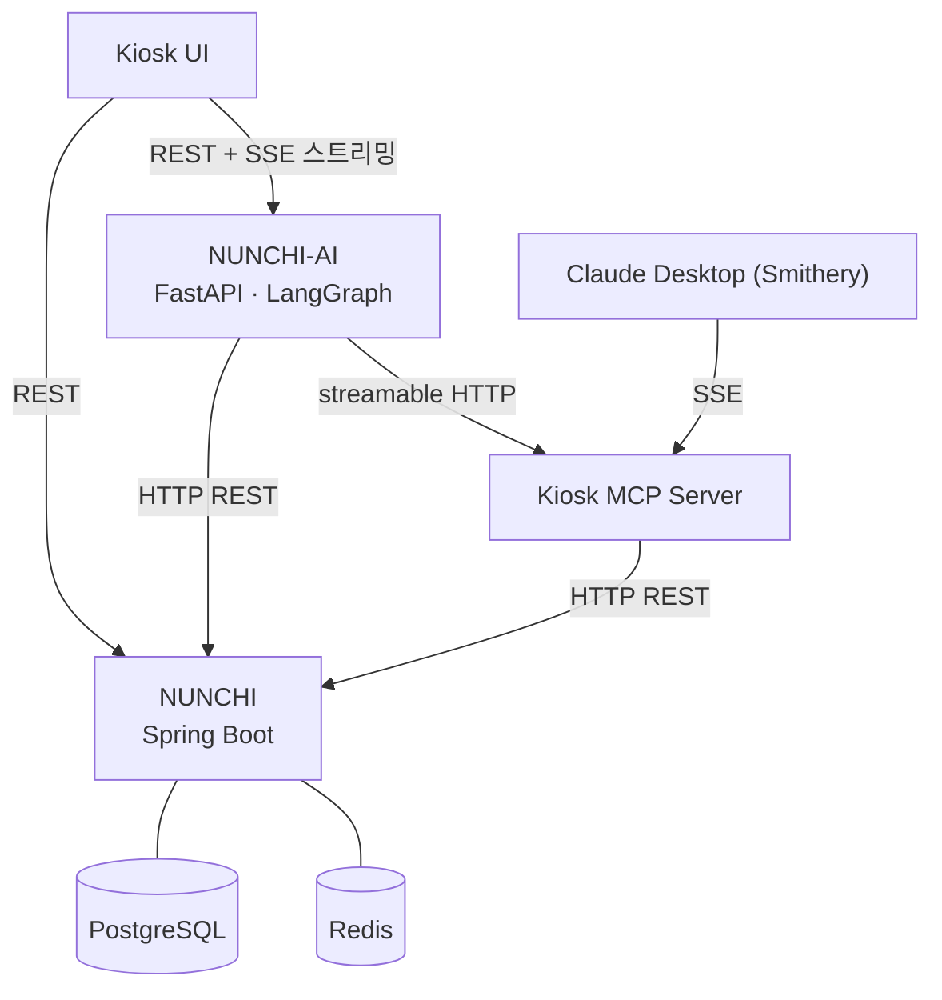

# 👀 NUNCHI — 눈치 키오스크

> 주문할 때 눈치보지 마세요, AI가 당신의 눈치를 파악해요

LLM Agentic AI 기반 배리어프리 자율주문 키오스크입니다.  
음성 대화만으로 메뉴 탐색 → 추천 → 담기 → 결제까지 완료할 수 있으며,  
사용자가 말하지 않아도 AI가 망설임을 감지해 먼저 도움을 제안합니다.

 

## 📦 Repositories

| 레포 | 설명 | 기술 |
|------|------|------|
| [NUNCHI](https://github.com/CapstoneDgu/NUNCHI) | Spring Boot 백엔드 + React 키오스크 프론트엔드 | Java · JavaScript |
| [NUNCHI-AI](https://github.com/CapstoneDgu/NUNCHI-AI) | FastAPI AI 서버 — 음성 파이프라인 · LangGraph 에이전트 · MCP Tool | Python |

 

## 🏗️ 시스템 구조

 
